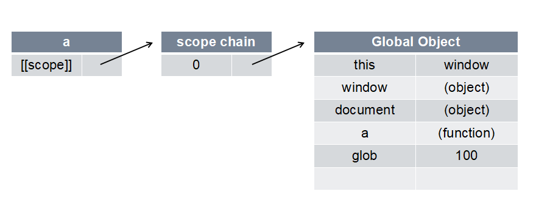
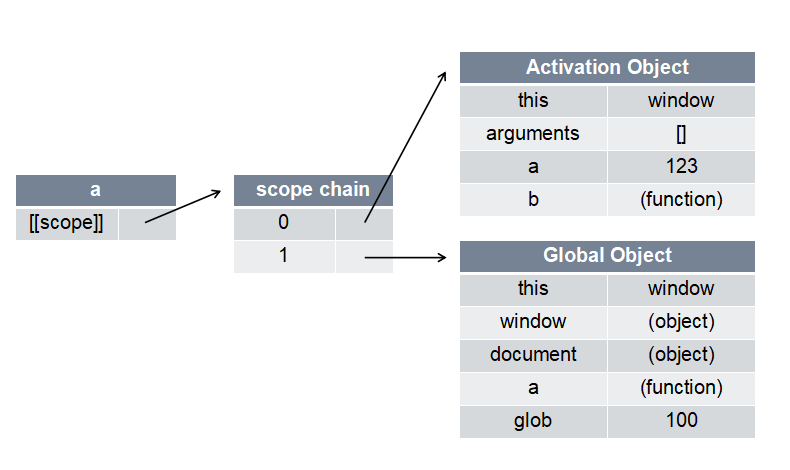

### 全局变量
1. 一切声明的全局变量，全是window的属性  //window就是全局的域  
    `eg: var a = 123; ==> window.a = 123;`
2. imply global暗示全局变量：即任何变量，如果未经声明就赋值，此变量就为全局变量所有  
    `eg: function fn() { a = 321 } ==> window.a = 321;`


### 预编译  

##### 函数执行前发生的预编译
1. 创建AO对象 Activation Object(执行期上下文)  
2. 找函数形参和变量声明，将变量和形参名作为AO属性名，值为undefined
3. 将实参和形参统一
4. 在函数体里面找函数声明，值赋予函数体

```js
    function fn (a, b) {
        console.log(a);  // function a () {}
        console.log(b);  // undefined
        var b = 234;
        console.log(b);  // 234
        a = 123;
        console.log(a);  // 123
        function a () {}
        var a;
        b = 234;
        var b = function () {}
        console.log(a);  // 123
        console.log(b);  // function b () {}
    }
    fn(1);  //先预编译，再执行

    // 预编译过程
    // 1. 创建AO
    AO = {}
    // 2. 找函数形参和变量声明，作为AO属性名，值为undefined
    AO = {
        a : undefined,
        b : undefined,
    }
    // 3. 将实参和形参统一
    AO = {
        a : 1,
        b : undefined,
    }
    // 4. 在函数体里面找函数声明，值赋予函数体
    AO = {
        a : function a () {},
        b : undefined,
    }

    //执行过程
    //对AO对象内部的变量赋值和访问
```

##### 全局预编译
1. 创建GO对象 Global Object  // GO === window
2. 找变量声明，作为GO的属性，值为undefined
3. 找函数声明，值为函数体


### 作用域

> `[[scope]]`: 每个JavaScript函数都是一个对象，对象中有些属性我可以访问，但有些不可以，这些属性仅供JavaScript引擎存取，`[[scope]]`就是其中一个。  
`[[scope]]`指的就是我们所说的作用域，其中存储了执行期上下文的集合

> 作用域链: `[[scope]]`中存储的执行期上下文对象的集合，这个集合呈链式链接，我们把这种链式链接叫做作用域链。

> 执行期上下文: 当函数执行时，会先创建一个称为执行期上下文的内部对象。一个执行期上下文定义了一个函数执行时的环境，函数每次执行时对应的执行期上下文都是独一无二的，所以多次调用一个函数会导致创建多个执行上下文，当函数执行完毕，它所产生的执行上下文就会被销毁。  


1. 当a函数定义时  
  
2. 当a函数执行时  
  

```js
    function a() {}
    var glob = 100;
    a();

    // a函数被定义
    // a.[[scope]] --> 0: GO {}
    // a执行
    // a.[[scope]] --> 0: AO {}
    //                 1: GO {}

```
```js
    function a() {
        function b() {
            var b = 234;
        }
        var a = 123;
        b();
    }
    var glob = 100;
    a();

    // a函数被定义
    // a.[[scope]] --> 0: GO {}
    // a执行
    // a.[[scope]] --> 0: a.AO {}
    //                 1: GO {}

    // b函数被定义
    // b.[[scope]] --> 0: a.AO {}
    //             --> 1: GO {}
    // b执行
    // b.[[scope]] --> 0: b.AO {}
    //             --> 1: a.AO {}
    //             --> 2: GO {}

    // 函数执行完后会删除AO，再次执行会生成新的AO。

    // 注意：当b执行完毕后，a才算执行完毕。
    // 问题：a和b执行完后是删除了[[scope]]里的所有还是只删除自己的AO？此时a把a.AO删除后，b还在么？
```

__当查找变量的时候，从作用域链的顶端依次往下查找__  


### 闭包

```js
    function a() {
        function b() {
            var bbb = 234;
            console.log(aaa);
        }
        var aaa = 123;
        return b;
    }

    var glob = 100;
    var demo = a();
    demo();  // 可以访问aaa, 打印123

    // 注意：此时b被返回，则a执行完毕，但是此时b未被执行过。

    // b定义但未执行时拥有a.AO，被return出去后，a就执行完毕，a执行完毕就删除对a.AO的引用。此时b仍拥有a.AO，即使b执行完毕只会删除b.AO，而不会删除a.AO的引用。

    // 问题：a.AO是一直存在的么？（内存回收？）
```

+ 函数内部的函数被保存到外部(return一个函数)，则一定生成闭包（因为被返回的函数拥有之前函数环境的AO，此时该函数仍能访问到之前环境中的变量）。闭包会导致原有作用域链不释放，造成内存泄漏。

+ 闭包的作用：
    - 实现公有变量  
        + eg: 函数累加器
        ```js
            function add() {
                var count = 0;
                function demo() {
                    count ++;
                    console.log(count);
                }
                return demo;
            }

            var counter = add();

            counter();  // 1
            counter();  // 2
            counter();  // 3
        ```
    - 可以做缓存（存储结构）
        + eg: eater
        ```js
            function test() {
                var num = 100;
                function a() {
                    num ++;
                    console.log(num);
                }
                function b() {
                    num --;
                    console.log(num);
                }
                return [a, b];
            }

            var myArr = test();
            myArr[0]();  // 101
            myArr[1]();  // 100
        ```
        ```js
            function eater() {
                var food = "";
                var obj = {
                    eat: function() {
                        console.log("I am eating" + food);
                        food = "";
                    },
                    push: function(myFood) {
                        food = myFood;
                    }
                }
                return obj;
            }

            var eater1 = eater();
            eater1.push('banana');
            eater1.eat();
        ```
    - 可以实现封装，属性私有化
        + eg: Person();
    - 模块化开发，防止污染全局变量


### 立即执行函数

```js
    (function test(){
        // to do ...
    } ())

    console.log(test);  // Uncaught ReferenceError: test is not defined
```

```js
    // 两种写法
    (function () { ... }());  // W3C建议
    (function () { ... })();

    function test() {  // 函数声明
        console.log(1);
    }();  // Uncaught SyntaxError: Unexpected token ')'

    // 只有表达式才能被执行符号执行

    var test = function() {
        console.log(1);
    }();  // 1
    console.log(test);  // undefined
    // 被执行符号执行的函数表达式，会自动放弃函数。

    + function test() {  // 隐式转换为表达式（+ - ！ && ||）
        console.log(1);
    }();  // 1
    console.log(test);  // Uncaught ReferenceError: test is not defined
    // 函数隐式转换为表达式后，会自动放弃函数

    (function test() {  // ()也让函数隐式转换为表达式
        console.log(1);
    })();  // 1
    console.log(test);  // Uncaught ReferenceError: test is not defined

    (function test() {  // ()也让函数隐式转换为表达式
        console.log(1);
    }());  // 1
    console.log(test);  // Uncaught ReferenceError: test is not defined

    // 因为函数被释放了，所以不取名
```

```js
    function test(a, b, c, d) {
        console.log(a + b + c + d);
    }(1, 2, 3, 4);
    // 不会报错，浏览器识别为：
    function test(a, b, c, d) {
        console.log(a + b + c + d);
    }
    (1, 2, 3, 4);
```


### 闭包问题的解决

```js
    function test() {
        var arr = [];
        for(var i = 0; i < 10; i ++) {
            arr[i] = function () {  // 在执行test函数时，把函数体（的地址）赋给数组里每一位，数组里的i在循环的时候就立即改变。
                console.log(i);  // 只有当返回出去的数组内函数执行的时候，才去作用域链中找i的值
            }
        }
        return arr;
    }

    var myArr = test();  // test执行完，此时i已经为10
    for(var j = 0; j < 10; j ++) {
        myArr[j]();  // 此处返回出来的数组里的函数才开始执行，才去作用域链中找i的值。因为闭包，此处数组内函数访问的都是同一个i，切由于上一句test执行完i变为10。
    }
    // 打印十个10
```
若程序要求按照语义，通过外部执行函数打印0-9的数字。解决闭包：
```js
    function test() {
        var arr = [];
        for(var i = 0; i < 10; i ++) {
            (function (j) {
                arr[j] = function () {
                    console.log(j);  // 找的是对应立即执行函数里的j（即形参j），立即执行函数执行后会销毁，每一个立即执行函数的AO被保存到外部，每一个j不同。
                }
            }(i));
        }
        return arr;
    }

    var myArr = test();
    for(var j = 0; j < 10; j ++) {
        myArr[j]();
    }
```
```html
    <ul>
        <li></li>
        <li></li>
        <li></li>
    </ul>

    <script>
        function test() {
            var liCollection = document.getElementsByTagName('li');

            for (var i = 0; i < liCollection.length; i ++) {
                liCollection[i].onclick = function () {  // 此类事件函数就将要执行的函数保存到外部了
                    console.log(i);
                }
            }
        }
        test();
    </script>
```
